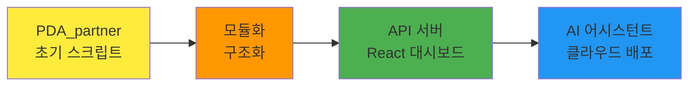
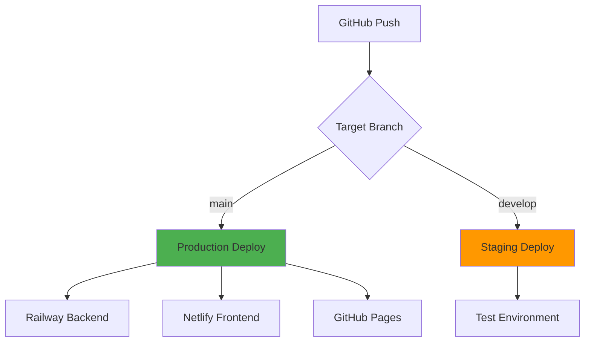

# 🏭 GST 통합 CI/CD 대시보드 시스템

> **AI 협업 기반으로 구축된 현대적 제조업 데이터 파이프라인 및 모니터링 시스템**

[](https://python.org/)
[](https://reactjs.org/)
[](https://openai.com/)
[](https://*****)
[](https://*****)

<!-- 
공개용 README 파일입니다.
민감한 정보는 ***** 처리되어 있습니다.
실제 배포 시 환경변수를 통해 설정하세요.
-->

## 📋 목차

- [🎯 시스템 개요](#-시스템-개요)
- [🏗️ 모듈별 구성](#️-모듈별-구성)
- [🤖 AI 어시스턴트](#-ai-어시스턴트)
- [🚀 설치 가이드](#-설치-가이드)
- [⚙️ 환경 설정](#️-환경-설정)
- [📊 대시보드 접속](#-대시보드-접속)
- [🔄 CI/CD 파이프라인](#-cicd-파이프라인)
- [📈 모니터링](#-모니터링)
- [🛠️ 트러블슈팅](#️-트러블슈팅)
- [🤝 기여 가이드](#-기여-가이드)

## 🎯 시스템 개요

GST 공장의 **제조 데이터를 실시간으로 수집, 분석, 시각화**하는 통합 시스템입니다. 단순한 파이썬 스크립트에서 시작하여 **AI 협업을 통해 고도화된 현대적 시스템**으로 발전했습니다.

### 📈 시스템 진화 과정



### 🎮 핵심 특징

- **📊 실시간 데이터 파이프라인**: Google Sheets → PostgreSQL → React 대시보드
- **🤖 AI 기반 어시스턴트**: OpenAI GPT-3.5 활용 슬랙 봇 
- **📱 반응형 웹 대시보드**: 다중 대시보드 지원 (공장/협력사/내부)
- **🔄 완전 자동화**: GitHub Actions CI/CD 파이프라인
- **☁️ 클라우드 네이티브**: Railway + Netlify 배포

## 🏗️ 모듈별 구성

### 1. 🤖 **협력사 평가 대시보드** 
```
📊 핵심 기능: 협력사별 품질 평가 지표 실시간 모니터링
🎯 KPI 계산: 불량건수(70%) + 누락비율(30%) 가중평균
📈 실시간 대시보드: 등급별 색상 구분, 상세 불량 내역 표시
```

**주요 특징:**
- 📈 실시간 데이터 수집 (Google Sheets + Google Drive)
- 🏆 스마트 순위 매김 (동일 점수 시 불량 건수 우선순위)
- 📋 상세 불량 내역 (제품S/N, 발생일, CSV 다운로드)
- ☁️ 클라우드 백업 (Google Drive 자동 백업)
- ⏰ 자동 스케줄링 (매월 마지막 평일 실행)

**KPI 평가 기준:**
| 구분 | A등급 | B등급 | C등급 | D등급 |
|------|-------|-------|-------|-------|
| **NaN 비율** | <1% | 1-3% | 3-6% | ≥6% |
| **기구 불량건수** | <6건 | 6-16건 | 17-27건 | ≥28건 |
| **전장 불량건수** | <1건 | 1-3건 | 4-6건 | ≥7건 |

### 2. 🏭 **GST Factory Pipeline** 
```
🔄 ETL 파이프라인: Google Sheets → PostgreSQL → React 대시보드
🤖 슬랙 봇 AI: OpenAI GPT-3.5 기반 지능형 어시스턴트
🌐 다중 대시보드: 공장/협력사/내부 대시보드 지원
```

**실제 서비스:**
- **공장 대시보드**: `https://*****` <!-- 실제 URL 숨김 처리 -->
- **백엔드 API**: `https://*****` <!-- 실제 URL 숨김 처리 -->
- **슬랙 봇**: GST Factory 지능형 봇 (사내 슬랙 워크스페이스)

**기술 스택:**
- **Backend**: Python 3.8+, Flask 2.3+, PostgreSQL
- **Frontend**: React 18.2.0, Chart.js 4.4.3, Recharts 2.12.7
- **AI**: OpenAI GPT-3.5, Slack SDK 3.26.2
- **인프라**: Railway (Backend), Netlify (Frontend)

### 3. 📅 **협력사 출입 관리**
```
📊 일자별 관리: 협력사별 출입 현황 실시간 모니터링
📅 최근 7일 자동: 주단위 데이터 자동 관리
🎨 고유 색상: 협력사별 색상 구분 시스템
```

**자동화 특징:**
- 🚀 GitHub Actions 매일 5회 자동 실행 (8:10, 9:10, 17:10, 18:10, 20:10 KST)
- 💾 GitHub JSON 기반 CSV 다운로드
- 🔄 중복 데이터 자동 정리

**협력사별 색상 시스템:**
```javascript
var companyColors = {
    'BAT': ['#FF6B6B', '#FF8E8E'],      // 빨간색 계열
    'C&A': ['#4ECDC4', '#7ED7D1'],      // 청록색 계열  
    'FNI': ['#45B7D1', '#6BC5D8'],      // 파란색 계열
    'P&S': ['#96CEB4', '#AFDCC4'],      // 녹색 계열
    'TMS(E)': ['#FFEAA7', '#FFF2C7'],   // 노란색 계열
    'TMS(M)': ['#DDA0DD', '#E6B8E6'],   // 보라색 계열
    'TEST': ['#FFB347', '#FFC470']      // 오렌지색 계열
};
```

### 4. 📊 **불량 분석 대시보드**
```
📊 실시간 연동: Google Sheets 불량 데이터 자동 분석
🎨 모던 UI: 카드 뷰와 인터랙티브 차트
📋 제품별 요약: 불량 건수와 주요 분류 표시
```

**자동 배포 스케줄:**
- **매일 오전 9시** (한국 시간)
- **매일 오후 2시** (한국 시간)  
- **매일 오후 6시** (한국 시간)
- **코드 푸시 시** (main 브랜치)

### 5. 🤖 **불량 예측 시스템**
```
🤖 ML 기반 예측: RandomForest + TF-IDF 불량 확률 예측
📊 Teams 연동: Microsoft Teams 실시간 데이터 로드
⚖️ 생산량 가중치: 실제 생산량 반영한 예측
```

**2025년 7월 베타 서비스:**
- ✅ 7월 생산물량 96대 → 156대 (+62.5%)
- ✅ 모델 다양성 5개 → 10개 모델 (GAIA-II, DRAGON 계열 추가)
- ✅ 동적 분기별 차트 자동 생성
- ✅ 실시간 대시보드 외주사별/조치유형별 통합 분석

### 6. 🔄 **생산 데이터 자동화**
```
📊 작업시간 분석: NaN/오버타임 분석, 진행률 계산
🗺️ 히트맵 생성: 주간/월간, 파트너별/모델별
📧 자동 알림: 이메일/카카오톡 알림 시스템
```

**히트맵 시스템:**
- **주간 히트맵**: 매주 실행 시 자동 생성
- **월간 히트맵**: 매월 마지막 금요일 자동 생성 (협력사별/모델별)
- **📊트렌드 지표**: HTML 리포트 히트맵 링크 통합

## 🤖 AI 어시스턴트

### 🎯 슬랙 봇 핵심 기능

#### 📊 **시리얼 넘버 기반 조회**
```
💬 사용자: "sn 5785 진행률 알려줘"
🤖 봇: 인터랙티브 메뉴 제공
    📈 진행률 조회
    📋 스프레드시트 URL  
    📅 일정 정보
    👥 파트너 정보
    📊 전체 정보
```

#### 🧠 **지능형 질문 분석**
```python
# 지능형 질문 분석 워크플로우
사용자 질문 → GPT 분석 → 의도 파악 → 
├─ 시리얼 조회: DB 조회 + GPT 자연어 응답
├─ 시리얼 누락: 재질문 메시지  
├─ 월별 검색: 조건 검색 + 결과 제공
└─ 일반 질문: GPT 공장 관리 조언
```

#### 🔍 **월별 조건 검색**
```
💬 사용자: "이번달 7월 생산물량 진행률 100% sn 알려줘"
🤖 봇: 조건에 맞는 시리얼 넘버 목록 제공
```

#### 💡 **공장 관리 AI 상담**
- **생산성 향상**: "생산성 향상 방법은?"
- **품질 관리**: "품질 관리 어떻게 해야 하나요?"
- **안전 관리**: "공장 안전 관리 팁 알려주세요"

### 📈 **성과 지표**
- **응답 시간**: 평균 2-3초 내 응답
- **정확도**: 시리얼 넘버 조회 99% 정확도
- **사용성**: 자연어 질문 95% 이상 이해
- **가용성**: 24/7 무중단 서비스

## 🚀 설치 가이드

### 1. 시스템 요구사항
```bash
Python 3.8+
Node.js 16.0.0+
PostgreSQL 12+
Git
```

### 2. 저장소 클론
```bash
git clone https://github.com/*****/gst-factory-system.git
cd gst-factory-system
```

### 3. 백엔드 설정
```bash
# 가상환경 설정
python -m venv venv
source venv/bin/activate  # Windows: venv\Scripts\activate

# 의존성 설치
pip install -r requirements.txt

# 데이터베이스 설정
createdb gst_factory_db
psql -U postgres -d gst_factory_db -f setup/schema.sql
```

### 4. 프론트엔드 설정
```bash
cd factory-dashboard
npm install
npm start
```

## ⚙️ 환경 설정

### 환경변수 템플릿 (.env)
```bash
# ===== 데이터베이스 설정 =====
DB_USER=*****
DB_PASS=*****
DB_HOST=localhost
DB_PORT=5432
DB_NAME=gst_factory_db

# ===== Google API 설정 =====
SHEETS_JSON_KEY_PATH=/path/to/credentials.json
DRIVE_JSON_KEY_PATH=/path/to/credentials.json
SPREADSHEET_ID=*****
DRIVE_FOLDER_ID=*****

# ===== 슬랙 봇 설정 =====
SLACK_BOT_TOKEN=xoxb-*****
SLACK_SIGNING_SECRET=*****

# ===== OpenAI API 설정 =====
OPENAI_API_KEY=sk-proj-*****

# ===== Auth0 설정 =====
AUTH0_DOMAIN=*****.auth0.com
API_IDENTIFIER=*****

# ===== GitHub 설정 =====
GITHUB_TOKEN=*****
GITHUB_REPO_1=username/repository1
GITHUB_REPO_2=username/repository2

# ===== 이메일 설정 =====
SMTP_SERVER=smtp.gmail.com
SMTP_PORT=587
EMAIL_ADDRESS=*****@gmail.com
EMAIL_PASS=*****
RECEIVER_EMAIL=*****@gmail.com

# ===== 카카오톡 API 설정 =====
KAKAO_REST_API_KEY=*****
KAKAO_REFRESH_TOKEN=*****

# ===== Microsoft Teams 설정 =====
TEAMS_TENANT_ID=*****
TEAMS_CLIENT_ID=*****
TEAMS_CLIENT_SECRET=*****

# ===== 시스템 설정 =====
TEST_MODE=True
LOG_LEVEL=INFO
TARGET_MONTH=2025-07
```

### Google API 설정 가이드
1. Google Cloud Console에서 프로젝트 생성
2. Google Sheets API 및 Google Drive API 활성화
3. 서비스 계정 생성 및 JSON 키 파일 다운로드
4. 스프레드시트에 서비스 계정 이메일 공유 권한 부여

### 슬랙 앱 설정 가이드
```bash
# Event Subscriptions
Request URL: https://*****.up.railway.app/slack/events

# Interactive Components  
Request URL: https://*****.up.railway.app/slack/interactive

# OAuth & Permissions - Bot Token Scopes:
- app_mentions:read
- channels:read
- chat:write
- im:read
- im:write
```

## 📊 대시보드 접속

### 🌐 공개 대시보드
| 서비스 | URL | 설명 |
|--------|-----|------|
| **공장 대시보드** | `https://*****` | Auth0 인증 필요 |
| **백엔드 API** | `https://*****` | REST API 서버 |
| **API 문서** | `https://*****/api/docs` | Swagger 문서 |

<!-- 실제 URL은 환경변수나 별도 설정에서 관리 -->

### 🔒 내부 대시보드
| 모듈 | 실행 방법 | 설명 |
|------|-----------|------|
| **협력사 평가** | `python partner_kpi_refactored.py` | KPI 대시보드 생성 |
| **출입 관리** | GitHub Actions 자동 배포 | 출입 현황 모니터링 |
| **불량 분석** | 자동 배포 (multiple repos) | 불량 데이터 분석 |
| **ML 예측** | `python run_refactored_dashboard.py` | 불량 예측 대시보드 |
| **데이터 자동화** | `python PDA_patner.py` | 생산 데이터 처리 |

## 🔄 CI/CD 파이프라인

### 📦 배포 전략



### 🚀 GitHub Actions 설정

#### 자동 배포 워크플로우
```yaml
# .github/workflows/auto-deploy.yml
name: Auto Deploy Dashboards
on:
  schedule:
    - cron: '0 9,14,18 * * *'  # 매일 9시, 2시, 6시 (KST)
  push:
    branches: [main]
  workflow_dispatch:

jobs:
  deploy-all:
    runs-on: ubuntu-latest
    strategy:
      matrix:
        module: [
          'partner-kpi',
          'entry-management', 
          'defect-analysis',
          'ml-prediction',
          'data-automation'
        ]
    steps:
      - uses: actions/checkout@v3
      - name: Setup Python
        uses: actions/setup-python@v4
        with:
          python-version: 3.9
      - name: Install dependencies
        run: |
          cd ${{ matrix.module }}
          pip install -r requirements.txt
      - name: Deploy Module
        run: |
          cd ${{ matrix.module }}
          python main.py
        env:
          # 환경변수는 GitHub Secrets에서 설정
          GOOGLE_API_KEY: ${{ secrets.GOOGLE_API_KEY }}
          DATABASE_URL: ${{ secrets.DATABASE_URL }}
          # 기타 필요한 환경변수들...
```

#### Netlify 배포 설정
```toml
# netlify.toml
[build]
  command = "npm run build"
  publish = "build/"

[build.environment]
  NODE_VERSION = "16"

[[redirects]]
  from = "/*"
  to = "/index.html"
  status = 200

# 환경변수는 Netlify Dashboard에서 설정
```

#### Railway 배포 설정
```json
{
  "build": {
    "builder": "NIXPACKS"
  },
  "deploy": {
    "startCommand": "python factory_main.py",
    "healthcheckPath": "/api/health"
  }
}
```

## 📈 모니터링

### 🎯 핵심 KPI 지표

#### 📊 **생산 관련 KPI**
- 📈 **주간/월간 생산량**: 목표 대비 달성률
- 🎯 **품질 지표**: 불량률, 수율, A등급 비율
- ⏰ **작업 효율성**: 평균 작업시간, 오버타임 발생률  
- 🤝 **협력사 성과**: KPI 점수, 등급 분포

#### 🤖 **시스템 성능 KPI**
- ⚡ **API 응답 시간**: 평균 2-3초 이내
- 🎯 **AI 봇 정확도**: 시리얼 넘버 조회 99% 정확도
- 🔄 **데이터 동기화**: 실시간 업데이트 성공률
- 📱 **대시보드 가용성**: 99.9% 업타임

### 🔔 알림 시스템

```python
# 통합 알림 설정 예시
ALERTS = {
    "defect_rate_threshold": 5.0,     # 불량률 5% 초과 시
    "overtime_threshold": 120,        # 오버타임 2시간 초과 시
    "nan_rate_threshold": 3.0,        # NaN 비율 3% 초과 시
    "kpi_grade_drop": "B",           # KPI 등급 B 이하 시
}

# 알림 채널
NOTIFICATION_CHANNELS = [
    "slack",      # 슬랙 봇 알림
    "email",      # 이메일 리포트  
    "kakao",      # 카카오톡 메시지
    "dashboard"   # 대시보드 내 알림
]
```

## 🛠️ 트러블슈팅

### 🔧 공통 문제 해결

#### 1. 데이터베이스 연결 오류
```bash
# PostgreSQL 서비스 확인
sudo systemctl status postgresql

# 연결 테스트
psql -U your_username -d gst_factory_db -c "SELECT 1;"

# 권한 확인
GRANT ALL PRIVILEGES ON DATABASE gst_factory_db TO your_username;
```

#### 2. Google API 인증 오류
```bash
# 서비스 계정 키 파일 확인
ls -la config/*.json

# Google Cloud Console에서 확인 사항:
# - Google Sheets API 활성화
# - Google Drive API 활성화  
# - 서비스 계정 키 유효성
# - 스프레드시트 공유 권한
```

#### 3. 슬랙 봇 응답 없음
```bash
# 봇 토큰 확인
echo $SLACK_BOT_TOKEN

# 이벤트 URL 테스트
curl -X POST https://*****.up.railway.app/slack/events

# 슬랙 앱 설정 확인:
# - Event Subscriptions URL
# - Interactive Components URL
# - Bot Token Scopes
```

#### 4. 프론트엔드 빌드 오류
```bash
# 캐시 정리 및 재설치
rm -rf node_modules package-lock.json
npm install

# 환경변수 확인
cat .env

# 빌드 테스트
npm run build
```

### 📊 모듈별 트러블슈팅

#### 협력사 평가 대시보드
```bash
# 데이터 정합성 확인
python test_data_integrity.py --verbose

# 백업 시스템 확인  
python drive_backup_manager.py info

# KPI 계산 검증
python -m pytest tests/test_kpi_calculation.py
```

#### ML 예측 시스템
```bash
# Teams API 연동 테스트
python -m data.teams_loader --test

# 모델 재학습
python main.py --mode retrain

# 예측 정확도 검증
python -m tests.test_ml_accuracy
```

## 🤝 기여 가이드

### 개발 환경 설정
```bash
# 1. 저장소 포크 및 클론
git clone https://github.com/your-username/gst-factory-system.git
cd gst-factory-system

# 2. 개발 브랜치 생성
git checkout -b feature/새기능명

# 3. 개발 환경 설정
python -m venv venv
source venv/bin/activate
pip install -r requirements-dev.txt

# 4. 테스트 실행
python -m pytest tests/ -v

# 5. 코드 품질 검사
black . && isort . && flake8 .
```

### 커밋 메시지 컨벤션
```
feat: 새로운 기능 추가
fix: 버그 수정  
docs: 문서 수정
style: 코드 포맷팅
refactor: 코드 리팩토링
test: 테스트 코드
chore: 빌드 설정 등
ai: AI 관련 개선사항
dashboard: 대시보드 업데이트
```

### Pull Request 가이드
1. **기능 브랜치** 생성: `feature/기능명`
2. **테스트** 실행: 모든 테스트 통과 확인
3. **코드 품질** 검사: linting 및 formatting
4. **문서 업데이트**: README 및 주석 업데이트
5. **PR 생성**: 상세한 변경사항 설명

## 📝 개발 로드맵

### 🎯 단기 계획 (2025 Q3)
- [ ] **모바일 앱**: React Native 기반 모바일 대시보드
- [ ] **실시간 알림**: WebSocket 기반 실시간 업데이트
- [ ] **AI 예측 강화**: 더 정확한 불량 예측 모델
- [ ] **사용자 권한 관리**: 역할 기반 접근 제어

### 🚀 중기 계획 (2025 Q4)
- [ ] **고급 분석**: 통계적 품질 관리 (SPC) 기능
- [ ] **클라우드 네이티브**: Kubernetes 기반 마이크로서비스
- [ ] **데이터 레이크**: 빅데이터 분석 플랫폼 구축
- [ ] **IoT 연동**: 센서 데이터 실시간 수집

### 🎨 장기 비전 (2026)
- [ ] **디지털 트윈**: 공장 전체 디지털 트윈 구축
- [ ] **자동화 확대**: 완전 자율 운영 시스템
- [ ] **AI 최적화**: 생산 최적화 AI 어시스턴트
- [ ] **글로벌 확장**: 다국가 공장 통합 관리

## 📄 라이선스

이 프로젝트는 MIT 라이선스를 따릅니다. 자세한 내용은 [LICENSE](LICENSE) 파일을 참조하세요.

## 📞 연락처

- **프로젝트 기획**: GST 제조기술팀
- **이슈 및 제안**: GitHub Issues 활용
- **개발 방식**: AI 협업 기반 개발

---

## 🎉 특별 감사

이 프로젝트는 **AI 도구들과의 혁신적인 협업**으로 구현되었습니다:

### 🤖 **AI 협업 도구들**
- **Claude Sonnet**: 시스템 아키텍처 설계 및 코드 리팩토링
- **ChatGPT**: 기능 구현 및 문제 해결

### 🚀 **AI 협업의 성과**
- **6개 모듈**: 단일 스크립트 → 통합 시스템으로 진화
- **실시간 운영**: 24/7 무중단 서비스 제공
- **사용자 친화적**: 슬랙 봇을 통한 자연어 인터페이스
- **확장 가능**: 모듈형 아키텍처로 미래 확장성 확보

---

<!-- 
배포 시 주의사항:
1. 모든 ***** 표시된 부분은 환경변수나 별도 설정 파일에서 관리
2. GitHub Secrets를 통해 민감한 정보 관리
3. Netlify 환경변수에서 실제 URL 설정
4. 이 README는 공개 저장소용으로 안전함
-->

**🤖 Solo-Engineered with AI Power • GST Manufacturing**

⭐ **이 프로젝트가 도움이 되었다면 스타를 눌러주세요!**
